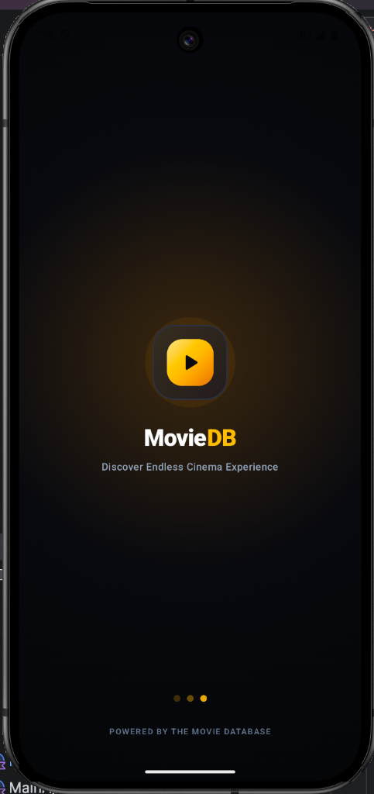
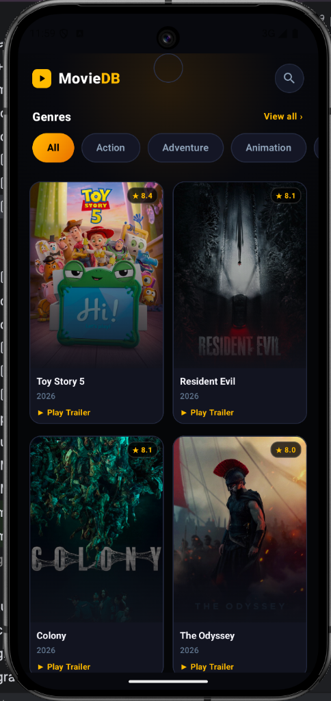
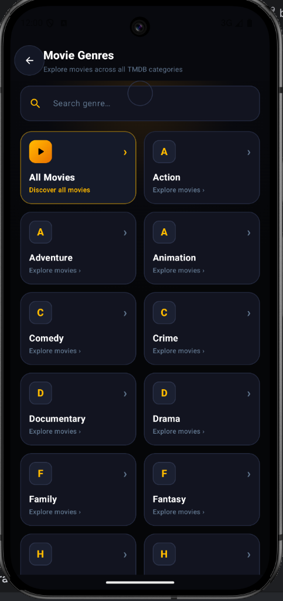
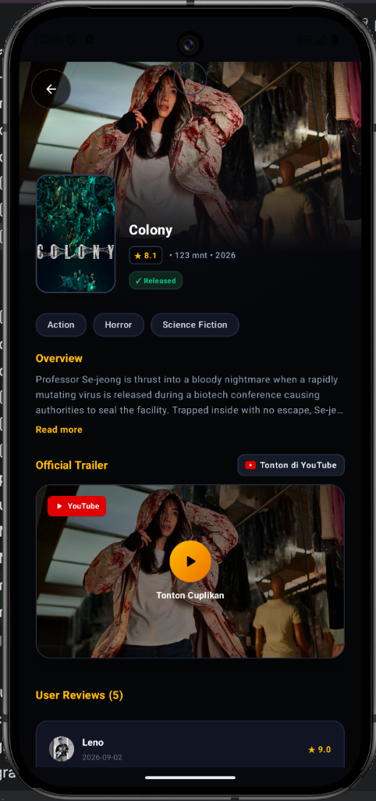

# 🎬 TMDB Cinema — Android Movie App

[](https://kotlinlang.org)
[](https://gradle.org)
[](https://developer.android.com/build)
[](https://developer.android.com/jetpack/compose)
[](https://m3.material.io/)
[](https://developer.android.com/topic/architecture)
[](https://developer.android.com/training/data-storage/room)
[](https://insert-koin.io/)
[](https://developer.android.com)

> **Aplikasi Android Modern untuk Eksplorasi Film TMDB dengan Desain Tema Gelap Sinematik, Dukungan Offline-First Caching, Server-Side Search, dan Pemutar Trailer YouTube.**

---

## 📱 Pratinjau Tampilan Aplikasi (App Preview)

Sebagai gambaran visual dari antarmuka modern yang telah dibangun, berikut adalah tangkapan layar utama aplikasi:

| 🚀 Splash Screen | 🏠 Home / Discover | 📂 Kategori Genre | 🎬 Detail & Trailer |
| :---: | :---: | :---: | :---: |
| <br/>**Animasi Logo, Glow, & TMDB Attribution** | <br/>**Grid Film, Chip Genre, & Infinite Scroll** | <br/>**Navigasi Seluruh Kategori Genre TMDB** | <br/>**Detail Lengkap, YouTube Player, & Reviews** |

---

## 📌 Tentang Aplikasi (About The App)

**TMDB Cinema** adalah aplikasi katalog dan penemuan film Android yang dibangun menggunakan standar industri pengembangan Android terkini. Aplikasi ini mengonsumsi RESTful API resmi dari **The Movie Database (TMDB)** untuk menyajikan data film terkini, ulasan, hingga video trailer resmi.

### 🌟 Fitur-Fitur Utama:
1. **Sinematik Splash Screen & Android 12+ SplashScreen API**: Menampilkan intro modern dengan efek animasi skala dan opasitas logo emblem, *ambient radial glow*, teks brand MovieDB, indikator *pulsing loading dots*, serta atribusi resmi TMDB. Terintegrasi penuh dengan `androidx.core:core-splashscreen` untuk pengalaman *cold startup* tanpa *flicker*.
2. **Pustaka Film Berdasarkan Genre**: Jelajahi ribuan film dengan navigasi genre yang mulus (*All, Action, Adventure, Animation, Comedy, Crime, Drama, Horror*, dll).
3. **Offline-First Room Caching**: Data film dan genre yang berhasil diunduh akan otomatis tersimpan di database lokal **Room** secara terisolasi per kategori genre. Saat pengguna tidak memiliki koneksi internet, aplikasi tetap dapat menampilkan data dari cache dengan indikator badge offline yang informatif.
4. **Pencarian Film Server-Side (TMDB API Search)**: Kolom pencarian responsif langsung terhubung dengan endpoint `GET /search/movie` TMDB yang dilengkapi dengan **Debounce 400ms** untuk efisiensi panggilan jaringan.
5. **Pemutar Cuplikan Resmi (YouTube Trailer Integration)**: Tonton cuplikan resmi film langsung di dalam aplikasi melalui WebPlayer terintegrasi atau buka secara otomatis di aplikasi YouTube bawaan.
6. **Ulasan Pengguna (User Reviews)**: Menampilkan review pengguna dengan fitur ekspansi teks ulasan (*Read More / Show Less*) dan pagination.
7. **Pull-to-Refresh Sinematik**: Perbarui data film dan genre kapan saja dengan efek tarikan bersih dan modern tanpa artefak visual statis.
8. **Fixed System Font Scale (Konsistensi Layout)**: Skala font aplikasi dikunci pada rasio standar (`fontScale = 1.0f`) di tingkat Jetpack Compose dan Android Context, sehingga tata letak UI tetap presisi dan tidak rusak meskipun pengguna mengatur ukuran font di perangkat HP menjadi sangat besar (*Extra Large*).

---

## 🛠️ Teknologi, Arsitektur & Perangkat (Tech Stack)

Aplikasi ini dirancang dengan prinsip modularitas, skalabilitas, dan kemudahan pengujian (*testability*) yang tinggi.

### 1. Bahasa & Tooling Inti
- **[Kotlin](https://kotlinlang.org/) (v2.2.10)**: Bahasa pemrograman resmi utama Android dengan dukungan fitur modern seperti Kotlin Coroutines, Kotlin Flow, dan Sealed Interfaces.
- **[Gradle](https://gradle.org/) (v9.7.1)**: Build system modern dengan verifikasi checksum SHA-256 dan dukungan JDK 17 / 21 / 25.
- **Android Gradle Plugin (AGP v9.3.2)**: Toolchain resmi Google untuk kompilasi Android mutakhir.

### 2. Pola Desain & Arsitektur (Design Pattern & Architecture)
Aplikasi menerapkan **Clean Architecture** yang dipadukan dengan pola **MVVM (Model-View-ViewModel)** serta prinsip **UDF (Unidirectional Data Flow)**:

```
┌───────────────────────────────────────────────────────────┐
│                 PRESENTATION LAYER (UI)                   │
│   Jetpack Compose Screens, Reusable Components, M3 Theme  │
│        MovieAndroidTheme (Fixed FontScale, Amber Glow)    │
│              GenreViewModel, MovieDetailViewModel         │
└─────────────────────────────▲─────────────────────────────┘
                              │
                    StateFlow │ Use Case Invocations
                              │
┌─────────────────────────────┴─────────────────────────────┐
│                    DOMAIN LAYER (Pure)                    │
│   Use Cases: GetDiscoverMovies, SearchMovies, Detail...   │
│         Domain Models (Movie, Genre, Review, Trailer)     │
│             Repository Interfaces (Abstractions)          │
└─────────────────────────────▲─────────────────────────────┘
                              │
                   Repository │ Implementation
                              │
┌─────────────────────────────┴─────────────────────────────┐
│                     DATA LAYER                            │
│   Repository Implementations, Entity/DTO Data Mappers     │
│   Local: Room Database, DAOs, SQLite Storage              │
│   Remote: Retrofit 2, OkHttp 3, TMDB REST API             │
└───────────────────────────────────────────────────────────┘
```

- **Presentation Layer**: Menangani rendering antarmuka pengguna secara deklaratif dengan Jetpack Compose, mengelola state layar melalui `StateFlow`, dan menangani interaksi pengguna dengan tema terpadu `MovieAndroidTheme`.
- **Domain Layer**: Lapisan murni (*Pure Kotlin*) tanpa dependensi framework Android. Berisi kontrak antarmuka repositori, entitas domain model, dan Use Case independen yang dapat diuji secara terisolasi.
- **Data Layer**: Bertanggung jawab atas persistensi data lokal (Room DB) dan komunikasi jaringan (Retrofit). Mengatur strategi *Single Source of Truth* dan pemetaan data (Data Mappers).

### 3. Perpustakaan & Alat Bantu (Libraries & Tools)
| Kategori | Teknologi / Library | Versi | Kegunaan |
| :--- | :--- | :--- | :--- |
| **UI Toolkit** | Jetpack Compose | BOM 2026.02.01 | Desain antarmuka modern deklaratif bertema sinematik |
| **Design System** | Material 3 & MovieAndroidTheme | M3 | Tema sinematik gelap, tipografi kustom, dan font scale terkontrol |
| **Splash Screen** | Core SplashScreen | v1.0.1 | Transisi startup halus & integrasi sistem Android 12+ SplashScreen API |
| **Dependency Injection** | Koin | v4.0.2 | DI ringan berbasis Kotlin DSL murni untuk injeksi UseCase, ViewModel, dan Repository |
| **Local Database** | Room Database & Room KTX | v2.7.2 | Penyimpanan cache offline lokal untuk film, genre, ulasan, dan detail (KSP compiler) |
| **Networking** | Retrofit 2 & OkHttp 3 | v2.11.0 / v4.12.0 | REST API client dengan Logging Interceptor dan Auth Interceptor TMDB |
| **Asynchronous** | Kotlin Coroutines & Flow | v2.2.10 | Pemrograman asinkron reaktif non-blocking |
| **Image Loading** | Coil Compose | v2.7.0 | Pemuatan dan *caching* poster & backdrop film dari TMDB |
| **Navigation** | Jetpack Navigation Compose | v2.8.8 | Navigasi halaman antar layar berbasis rute Compose type-safe |
| **Media Player** | Android YouTube Player | v13.0.0 | Pemutaran video cuplikan resmi YouTube terintegrasi |
| **Testing** | JUnit 4 & Coroutines Test | v4.13.2 / v1.8.1 | Pengujian unit test logika domain dan repositori |
| **Build System** | Gradle & AGP | v9.7.1 / v9.3.2 | Konfigurasi otomatis dependensi proyek berbasis Kotlin DSL |

---

## 📂 Struktur Direktori Proyek (Project Structure)

```
com.samsul.moviedb/
├── MainActivity.kt             # Single-Activity entry point, Core SplashScreen setup, Edge-to-Edge
├── MainApplication.kt          # Application class, Koin dependency injection initialization
├── core/
│   ├── network/
│   │   ├── AuthInterceptor.kt  # Otentikasi otomatis penyisipan API Key & Header TMDB
│   │   └── NetworkMonitor.kt   # Pemantau status koneksi internet perangkat secara reaktif
│   └── util/
│       ├── Constants.kt        # Konstanta konfigurasi TMDB, URL gambar, pesan error, dan rute
│       └── Resource.kt         # Wrapper sealed class (Success, Error, Loading) untuk aliran data
├── data/
│   ├── local/
│   │   ├── AppDatabase.kt      # Room Database konfigurasi entitas dan versi schema
│   │   ├── Converters.kt       # TypeConverter Room (misal: konversi List<Int> genre IDs)
│   │   ├── dao/                # Data Access Objects (MovieDao, GenreDao, MovieDetailDao, ReviewDao)
│   │   └── entity/             # SQLite Room Entities (MovieEntity, GenreEntity, MovieDetailEntity, ReviewEntity)
│   ├── mapper/
│   │   └── MovieMapper.kt      # Fungsi ekstensi pemetaan DTO/Entity ke Domain Model
│   ├── remote/
│   │   ├── TmdbApiService.kt   # Retrofit Interface untuk endpoint TMDB API
│   │   └── dto/                # Data Transfer Objects (MovieDto, GenreDto, MovieDetailDto, ReviewDto, VideoDto)
│   └── repository/
│       └── MovieRepositoryImpl.kt # Implementasi repositori dengan strategi Offline-First Caching
├── di/
│   └── AppModule.kt            # Definisi modul-modul Koin (Network, Database, Repository, UseCase, ViewModel)
├── domain/
│   ├── model/                  # Pure Kotlin Domain Models (Movie, Genre, MovieDetail, Review, Trailer)
│   ├── repository/             # Kontrak interface MovieRepository
│   └── usecase/                # Single-responsibility business logic:
│       ├── GetDiscoverMoviesUseCase.kt  # Eksplorasi film dengan pagination dan filter genre
│       ├── GetLatestMoviesUseCase.kt    # Mengambil rilis film terkini
│       ├── GetMovieDetailUseCase.kt     # Mengambil informasi mendalam film
│       ├── GetMovieGenresUseCase.kt     # Mengambil daftar kategori genre TMDB
│       ├── GetMovieReviewsUseCase.kt    # Mengambil ulasan pengguna dengan pagination
│       ├── GetMovieTrailerUseCase.kt    # Mengambil cuplikan video resmi YouTube
│       ├── GetPopularMoviesUseCase.kt   # Mengambil katalog film terpopuler
│       └── SearchMoviesUseCase.kt       # Pencarian film TMDB server-side dengan debounce
├── presentation/
│   ├── detail/                 # Layar MovieDetailScreen, MovieDetailViewModel, MovieDetailUiState
│   ├── genre/                  # Layar GenreScreen (Home/Discover), GenreViewModel, GenreUiState
│   │   └── all/                # Layar AllGenresScreen, AllGenresViewModel, AllGenresUiState
│   ├── movielist/              # Layar MovieListScreen (Daftar film per genre), ViewModel, UiState
│   ├── navigation/
│   │   ├── NavGraph.kt         # Pengaturan NavHost dan rute antar layar
│   │   └── Screen.kt           # Sealed class rute navigasi dan pembuat URI argumen
│   └── splash/
│       └── MovieSplashScreen.kt # Intro sinematik, Brand Logo, Ambient Glow, Loader Dots
└── ui/
    ├── components/             # Reusable UI Components:
    │   ├── CinemaMovieCard.kt     # Card film grid dengan rating bintang dan tombol Play Trailer
    │   ├── CinemaPullToRefresh.kt # Pull-to-refresh sinematik tanpa artefak visual
    │   ├── EmptyStateView.kt      # Tampilan status kosong dengan tombol refresh
    │   ├── ErrorStateView.kt      # Tampilan status error jaringan dengan tombol coba lagi
    │   ├── LoadingShimmer.kt      # Animasi skeleton shimmer (CategoryRow, MovieGrid, GenreList)
    │   ├── MoviePosterCard.kt     # Card poster film vertikal
    │   ├── OfflineBadge.kt        # Indikator badge data bersumber dari cache offline
    │   └── YouTubePlayerView.kt   # Integrasi pemutar video YouTube WebView responsif
    ├── preview/
    │   └── PreviewData.kt         # Mock data & PreviewConstants lengkap untuk @Preview Compose
    └── theme/
        ├── Color.kt               # Palet warna sinematik (CinemaAmber, CinemaGold, Dark Backgrounds)
        ├── Theme.kt               # MovieAndroidTheme dengan penguncian skala font (fontScale = 1.0f)
        └── Type.kt                # Konfigurasi tipografi Material 3
```

---

## 🔑 Panduan Pembuatan TMDB API Key

Aplikasi ini membutuhkan kunci akses API dari TMDB untuk melakukan *fetching* data film. Ikuti langkah-langkah berikut untuk mendapatkan API Key gratis:

1. **Daftar Akun TMDB**:
   - Buka peramban dan kunjungi [Halaman Pendaftaran TMDB](https://www.themoviedb.org/signup).
   - Isi formulir pendaftaran akun dan lakukan verifikasi email.
2. **Masuk ke Pengaturan Akun**:
   - Setelah masuk (*login*), klik ikon profil Anda di pojok kanan atas, lalu pilih **Settings**.
   - Pada panel menu samping kiri, klik menu **API** atau langsung akses URL: [https://www.themoviedb.org/settings/api](https://www.themoviedb.org/settings/api).
3. **Ajukan Permintaan API Key**:
   - Pada bagian permohonan API, klik tombol **Create** atau **Click here to apply for an API key**.
   - Pilih opsi **Developer** (untuk penggunaan personal/pengembangan).
   - Setujui syarat dan ketentuan penggunaan TMDB API.
4. **Isi Formulir Aplikasi**:
   - **Type of Use**: Personal / Education.
   - **Application Name**: `TMDB Cinema` (atau nama pilihan Anda).
   - **Application URL**: Isi dengan URL repositori GitHub Anda (misal: `https://github.com/Samsul-Arip/TMDB-Cinema`).
   - **Application Summary**: Tulis deskripsi singkat, misalnya: *"Aplikasi Android untuk eksplorasi film dan ulasan menggunakan TMDB API"*.
5. **Salin API Key**:
   - Setelah formulir disetujui, Anda akan langsung melihat bagian **API Key (v3 auth)** berupa 32 karakter alfanumerik (contoh: `c18967177842ccaa32f61701bd85c69b`).
   - Salin kunci ini untuk dimasukkan ke dalam file `local.properties`.

---

## 🚀 Panduan Instalasi & Menjalankan Aplikasi (Setup & Run)

### Prasyarat Sistem (Prerequisites):
- **Android Studio**: Ladybug | Koala | Meerkat atau versi lebih baru.
- **Java Development Kit (JDK)**: Versi 17, 21, atau 25.
- **Gradle**: Versi 9.7.1 (sudah disertakan melalui Gradle Wrapper `./gradlew`).
- **Android SDK**: Compile SDK 35 (Android 15), Min SDK 24 (Android 7.0).
- Koneksi internet aktif untuk sinkronisasi dependensi Gradle awal dan pengambilan data TMDB.

### Langkah-Langkah:

#### 1. Kloning Repositori
Jalankan perintah berikut di terminal Anda:
```bash
git clone https://github.com/Samsul-Arip/TMDB-Cinema.git
cd TMDB-Cinema
```

#### 2. Konfigurasi `local.properties`
Buka atau buat file bernama `local.properties` di **direktori root proyek** (sejajar dengan `settings.gradle.kts`). Tambahkan konfigurasi berikut dan sesuaikan lokasi Android SDK serta API Key TMDB Anda:

```properties
## Lokasi Android SDK di komputer Anda
sdk.dir=/Users/username/Library/Android/sdk # (macOS)
# sdk.dir=C\:\\Users\\username\\AppData\\Local\\Android\\Sdk # (Windows)
# sdk.dir=/home/username/Android/Sdk # (Linux)

## Konfigurasi Kunci & Endpoint TMDB
tmdb.api.key=MASUKKAN_TMDB_API_KEY_ANDA_DISINI
tmdb.base.url=https://api.themoviedb.org/3/
tmdb.image.base.url=https://image.tmdb.org/t/p/
```

> ⚠️ **Catatan Keamanan**: Nilai dari `tmdb.api.key`, `tmdb.base.url`, dan `tmdb.image.base.url` dikelola secara terisolasi di `local.properties` (yang diabaikan oleh `.gitignore`) dan diinjeksi secara aman ke dalam `BuildConfig` saat kompilasi (`BuildConfig.TMDB_API_KEY`).

#### 3. Buka di Android Studio & Sinkronkan Gradle
- Buka Android Studio, pilih **Open** dan arahkan ke folder proyek.
- Tunggu proses Gradle Sync selesai hingga semua dependensi terunduh.

#### 4. Menjalankan Unit Test
Untuk memverifikasi keandalan logika bisnis use case dan pemetaan repository:
```bash
./gradlew testDebugUnitTest
```

#### 5. Menjalankan Aplikasi
- Hubungkan perangkat fisik Android melalui USB Debugging atau jalankan Emulator Android (API level 24 ke atas).
- Tekan tombol hijau **Run 'app'** (`Shift + F10`) di Android Studio, atau jalankan perintah:
```bash
./gradlew installDebug
```

---

## 🧪 Pengujian Kualitas (Testing & Quality)

Proyek ini dilengkapi dengan unit test otomatis pada lapisan domain dan use case:
- **`SearchMoviesUseCaseTest`**: Memverifikasi pencarian film query cocok, hasil pencarian kosong, dan penanganan kegagalan jaringan.
- **`GetDiscoverMoviesUseCaseTest`**: Memverifikasi eksplorasi film, pagination, dan isolasi filter genre.
- **`GetMovieDetailUseCaseTest`**: Memverifikasi ketersediaan dan integritas data detail film.
- **`GetMovieGenresUseCaseTest`**: Memverifikasi pengambilan dan pemetaan daftar genre TMDB.
- **`GetMovieReviewsUseCaseTest`**: Memverifikasi pengambilan ulasan pengguna dan pagination.
- **`GetMovieTrailerUseCaseTest`**: Memverifikasi pemilahan dan prioritas trailer resmi YouTube.
- **`GetPopularMoviesUseCaseTest`**: Memverifikasi pengambilan katalog film populer.
- **`GetLatestMoviesUseCaseTest`**: Memverifikasi pengambilan rilis film terbaru.
- **`FakeMovieRepository`**: Test double terisolasi untuk pengetesan cepat dan deterministik tanpa ketergantungan jaringan eksternal.

---

## 👨‍💻 Kontributor & Lisensi

Dibuat dengan ❤️ oleh **[Samsul Arip](https://github.com/Samsul-Arip)**.

Proyek ini didistribusikan di bawah lisensi [MIT License](LICENSE). Bebas digunakan untuk keperluan edukasi, portofolio, dan pengembangan lanjutan.
